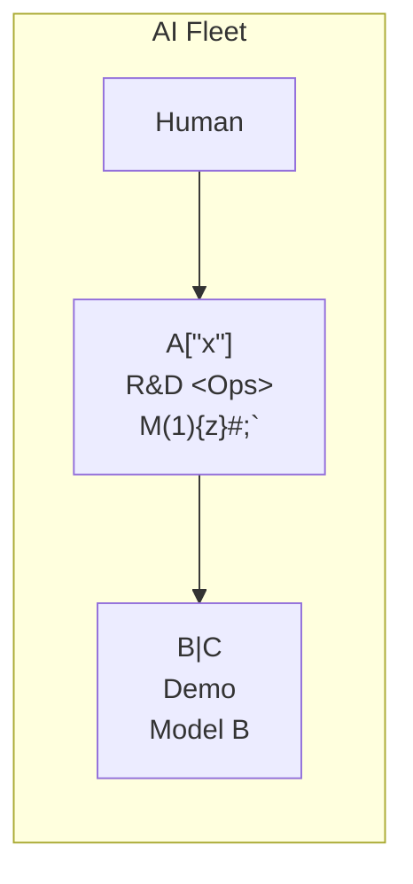

```mermaid
flowchart LR
  subgraph fleet["AI Fleet"]
    human["Human"]
    r1["A#91;#34;x#34;#93;<br/>R#38;D #60;Ops#62;<br/>M#40;1#41;#123;z#125;#35;#59;#96;"]
    r2["B#124;C<br/>Demo<br/>Model B"]
    human --> r1
    r1 --> r2
  end
```
